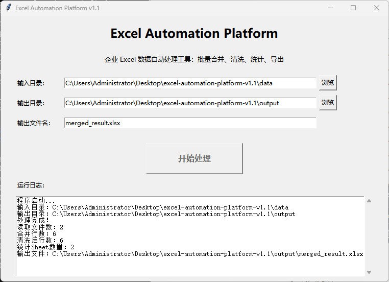
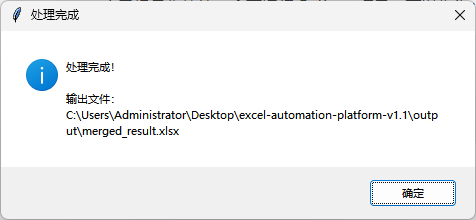
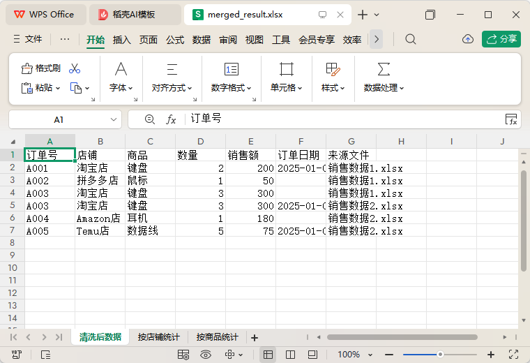
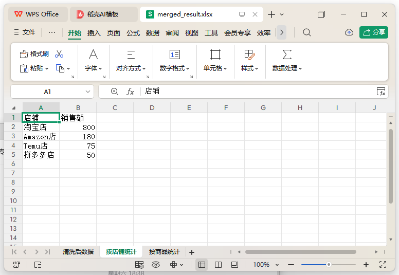

# 📊 Excel Automation Platform

> Enterprise Excel Data Processing Tool Based on Python

一个基于 Python 开发的 Excel 自动化处理工具，支持批量读取 Excel、数据清洗、去重、统计分析、结果导出及 GUI 图形界面，模拟企业运营数据处理场景。

---

# ✨ Project Features

- ✅ Batch import multiple Excel files
- ✅ Automatically merge Excel data
- ✅ Remove duplicate records
- ✅ Remove empty rows
- ✅ Standardize date format
- ✅ Sales statistics by store
- ✅ Sales statistics by product
- ✅ Export processed Excel reports
- ✅ Generate running logs
- ✅ Desktop GUI application

---

# 📷 Software Preview

## GUI Interface



---

## Cleaned Data



---

## Store Statistics



---

## Product Statistics



---

# 🏗 Workflow

```text
Excel Files
     │
     ▼
Batch Read
     │
     ▼
Merge Data
     │
     ▼
Data Cleaning
 ┌────┼──────────────┐
 │    │              │
 ▼    ▼              ▼
Empty Duplicate   Date Format
     │
     ▼
Statistics Analysis
     │
     ▼
Export Excel
     │
     ▼
Generate Log
```

---

# 📂 Project Structure

```text
excel-automation-platform/
│
├── config/
│   └── config.json
│
├── data/
│
├── docs/
│   ├── gui.png
│   ├── result.png
│   ├── sheet1.png
│   └── sheet2.png
│
├── src/
│   ├── reader.py
│   ├── cleaner.py
│   ├── exporter.py
│   ├── logger.py
│   ├── processor.py
│   └── statistics.py
│
├── gui.py
├── main.py
├── requirements.txt
├── README.md
└── .gitignore
```

---

# 🛠 Technology Stack

| Technology | Description |
|------------|-------------|
| Python | Core Language |
| Pandas | Excel Data Processing |
| OpenPyXL | Excel Read & Write |
| Tkinter | Desktop GUI |
| Logging | Runtime Log |
| Pathlib | File Management |

---

# 🚀 Quick Start

## Install Dependencies

```bash
pip install -r requirements.txt
```

---

## Run GUI

```bash
python gui.py
```

---

## Run Console Version

```bash
python main.py
```

---

# 💼 Business Scenario

This project simulates common enterprise office scenarios where multiple Excel reports need to be processed every day.

Applicable departments:

- Operations
- Sales
- Purchasing
- Warehouse
- Finance

Typical workflow:

1. Batch import multiple Excel files
2. Merge all reports
3. Clean duplicate data
4. Standardize date formats
5. Generate statistical reports
6. Export final Excel file

---

# ⭐ Project Highlights

- Modular architecture
- Desktop GUI
- Enterprise-oriented business scenario
- Batch Excel processing
- Automatic data cleaning
- Statistics report generation
- Logging support
- Easy to extend

---

# 📅 Version History

## v1.0

- Batch Excel Import
- Merge Multiple Files
- Remove Duplicate Records
- Remove Empty Rows
- Date Format Standardization
- Store Statistics
- Product Statistics
- GUI Interface
- Logging System

---

# 🔮 Roadmap

Planned features:

- Database Support
- REST API Integration
- Scheduled Tasks
- Email Reports
- Data Visualization Dashboard
- Multi-language Support

---

# 👨‍💻 Author

**Joy Wang**

RPA Developer | Python Automation Developer

GitHub：

https://github.com/wjoy00337-debug

---

⭐ If you find this project useful, feel free to Star this repository.
